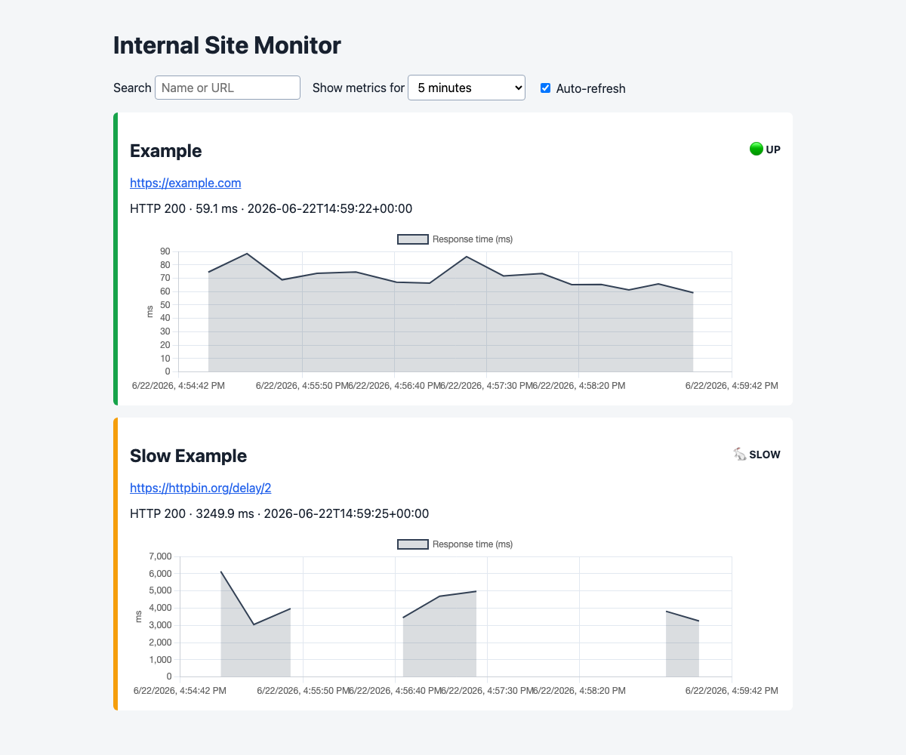

# Internal Site Monitor

A small internal availability monitor. It checks configured URLs, tracks
consecutive failures, stores recent response times, builds a Chart.js dashboard,
and optionally sends Slack or email state-change alerts.



## Setup

Python dependencies are not required. Copy and edit the example configuration:

```bash
cp config.example.json config.json
python3 internal_site_monitor.py check
python3 internal_site_monitor.py serve
```

Open `http://127.0.0.1:8000`. The server binds only to localhost by default.
While running, `serve` checks immediately and repeats every
`check_interval_seconds` configured in `config.json`.

History is retained for `history_retention_days` (seven days by default).
Chart.js is loaded from jsDelivr when the dashboard opens, so the browser needs
internet access. For an isolated internal network, download Chart.js into
`web/` and change the generated script URL to the local file.

## Alerts

Slack uses an incoming webhook stored outside the configuration:

```bash
export SLACK_WEBHOOK_URL='https://hooks.slack.com/services/...'
```

Email settings are in `config.json`; SMTP host and credentials are read from
the environment variables named there. Alerts are sent only when the configured
failure threshold is reached and when the site recovers. A single failed check
therefore does not immediately page the team. Slack and email are attempted
independently, and failed state-change alerts are retried on the next check.

Site names must be unique because they identify persisted state and history.

Generated runtime files live in `data/` and `web/`. Do not commit `config.json`
if it contains internal URLs, and never put webhook URLs or passwords in it.

Dashboard source files live in `frontend/`. Edit `index.html` for structure,
`styles.css` for appearance, and `dashboard.js` for chart behavior. The monitor
copies them into the generated `web/` directory automatically.

Topics demonstrated: HTTP requests, timing, JSON configuration, persisted
state, failure thresholds, Slack webhooks, SMTP, Chart.js, HTML generation, and
a small local HTTP server.
